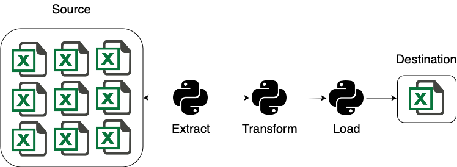

# Welcome to Zero
Zero shows the best Software Engineering's practices for Data Engineering projects.

## Introdution
Zero was created with the idea to improve the quality of Data Engineer projects. With a collection of tools that should appear at all projects. The key features of this project was built using those Libs.

* [poetry](https://python-poetry.org)
* [pyenv](https://github.com/pyenv/pyenv)
* [pandas](https://pandas.pydata.org)
* [pytest](https://docs.pytest.org/en/stable/)
* [random](https://github.com/python/cpython/blob/3.13/Lib/random.py)
* [faker](https://pypi.org/project/Faker/)
* [taskipy](https://github.com/taskipy/taskipy)

## Study Case

At this project we developed an pipeline to extract absenteeism's data from excel, transform them into just one dataframe and load this dataframe at some destination.